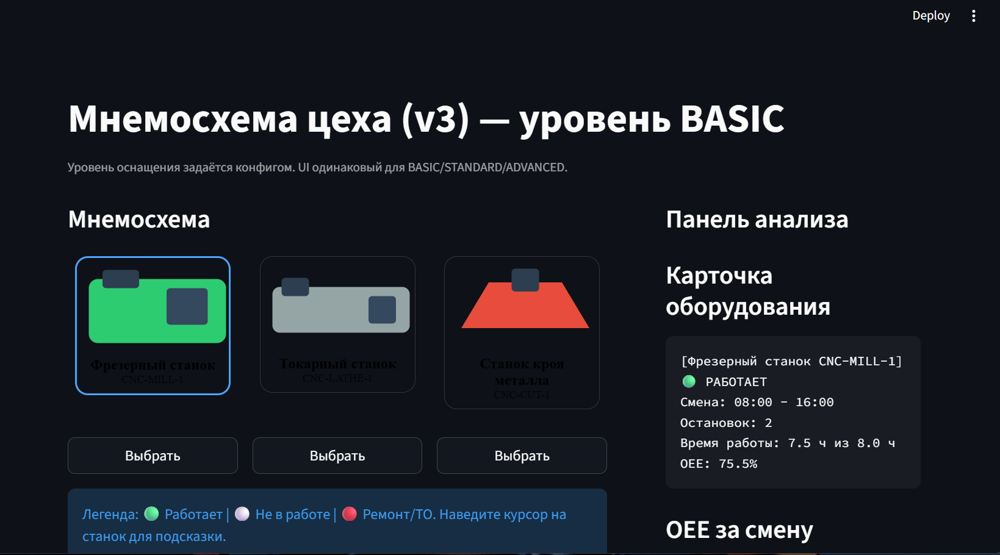
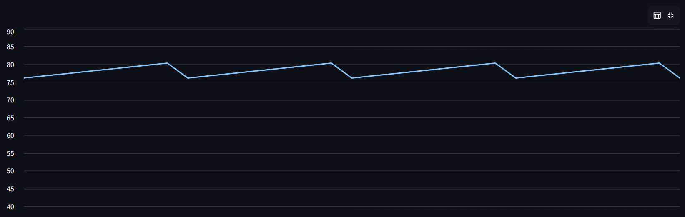

# 📊 OEE Shopfloor Mnemo (Streamlit)

Демо-проект цифровой **мнемосхемы производственного цеха** для визуального контроля оборудования, расчёта **OEE** и анализа остановок.  
Один и тот же интерфейс масштабируется под разные уровни автоматизации — **от Excel до IoT и аналитики**.

---

## 🖼 Общий вид: мнемосхема цеха



---

## 🎯 Зачем это нужно

Проект показывает, как может выглядеть “цифровой цех” без тяжёлого внедрения:
- диспетчер видит состояние оборудования в одной схеме;
- по клику получает OEE и простои;
- уровень детализации растёт вместе с оснащением производства.

---

## 👀 Что видно в интерфейсе

- SVG-силуэты оборудования (мнемосхема)
- Индикация состояния:
  - 🟢 **RUN** — работает
  - ⚪ **IDLE** — не в работе
  - 🔴 **DOWN** — ремонт / ТО
- Наведение → подсказка (tooltip)
- Клик по станку → панель анализа (карточка + OEE + остановки)

---

## 🖼 Панель анализа выбранного станка



---

## 🧠 Ключевая идея: версии ≠ уровни оснащения

**Один репозиторий — один продукт**

- **Версии (v1/v2/v3)** — развитие UI и сценариев (фиксируются через `git tags`)
- **Уровни (BASIC/STANDARD/ADVANCED)** — источник и глубина данных (через `config/` и `providers/`)

UI одинаковый для всех уровней. Меняются только данные и детализация.

---

## 🏭 Уровни оснащения

### BASIC — минимальная автоматизация
- ручной ввод / CSV / Excel
- OEE по смене
- только крупные остановки

### STANDARD — интеграция с MES
- данные из MES / БД
- агрегированный OEE
- структурированные причины простоев

### ADVANCED — IoT + аналитика
- события от PLC/датчиков
- микростопы, деградация
- near-real-time OEE
- основа для рекомендаций и предиктивного анализа

---

## 🧱 Структура проекта

```text
app.py                 Streamlit UI (общий для всех уровней)
config/                конфиги уровней (BASIC/STANDARD/ADVANCED)
src/providers/          провайдеры данных (mock / mes stub / iot stub)
src/data_mock.py        профилированные демо-данные по уровням
assets/silhouettes/     SVG-силуэты оборудования
assets/screenshots/     скриншоты для README

